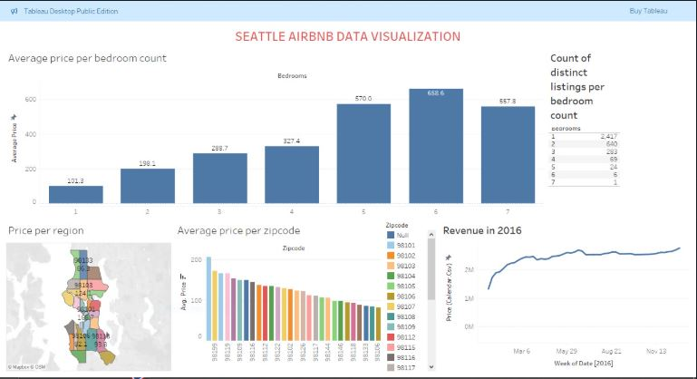

# 🏡 Seattle Airbnb Investment Dashboard

This dashboard helps identify the most profitable neighborhoods and factors influencing listing success for an Airbnb business in Seattle.

---

## 📸 Static Preview

---

## 🌐 Interactive Dashboard (Hosted on Tableau Public)

👉 [Click here to view the live dashboard]([https://public.tableau.com/views/YourDashboardName/YourVizName](https://public.tableau.com/views/Seattleairbnbdataviz/Dashboard1?:language=en-US&publish=yes&:sid=&:redirect=auth&:display_count=n&:origin=viz_share_link))

---

## 💾 Download the Tableau Workbook

📥 [Download Tableau Workbook (.twbx)](Seattle airbnb dataviz.twb)

> Open this file in Tableau Desktop to explore the dashboard interactively.

---

## 🔍 About the Project

- Dataset: Inside Airbnb - Seattle listings
- Tools: Tableau, Excel (for preprocessing)
- Objective: Find the best location and strategy for profitable Airbnb investment
